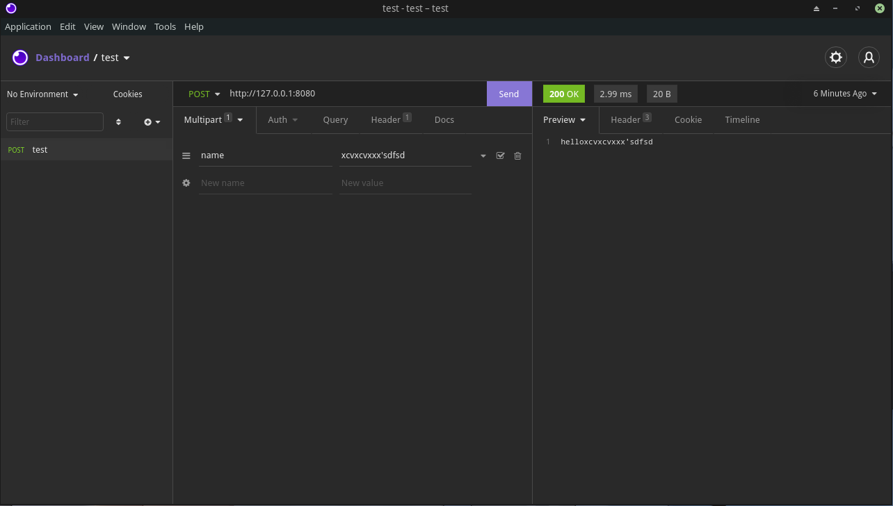
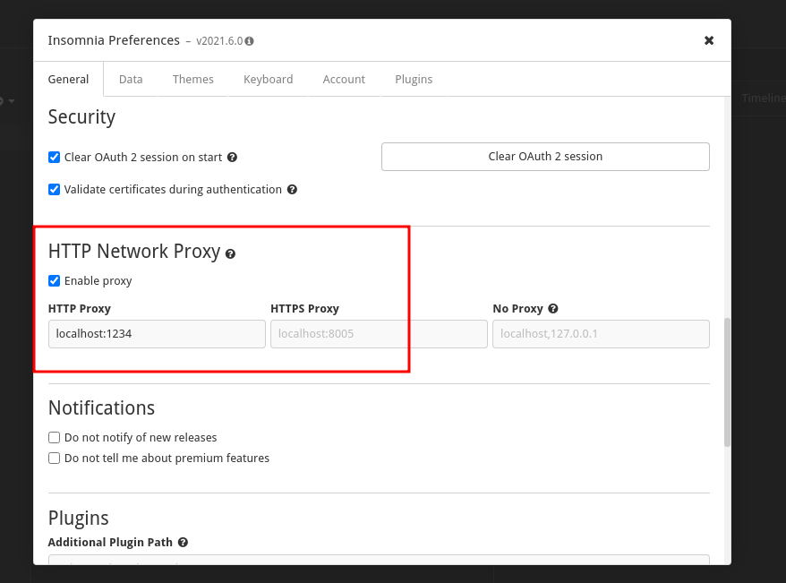

# 多线程Web代理服务器

使用：
```bash
python MultiThreadingProxyServer.py 127.0.0.1 1234
java MultiThreadingProxyServer.java 127.0.0.1 1234
```

使用浏览器测试的时候注意需要添加代理，可以使用插件或在设置中指定。

测试POST的时候，需要一个额外的服务器支持POST请求，这里使用Spring Boot创建了一个支持POST方法的服务器，工程文件在`SpringBootProject`下。

另外使用时请配合Postman/Insomnia使用，截图如下：





关于可选练习：

- 处理了404请求，只有200才会缓存
- 支持了POST方法，其他方法暂时不支持
- 由于测试网站并没有包含Expire或max-age字段，因此没有添加缓存过期支持
